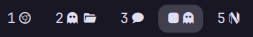

# My Workspaces

Hyprland workspace indicators with per-app icons for open windows. A `bar-widget` plugin for the Omarchy shell, based on the built-in `omarchy.workspaces` widget with an expanded app-icon rule set.



## Requirements

- Omarchy (Quattro) running on Hyprland
- A Nerd Font installed and set as the bar font so app glyphs render

## Installation

From the repository root:

```sh
omarchy plugin add https://github.com/SaifOmar/WorkspaceIcons.git --enable
```

Then add it to your bar:

```sh
omarchy bar plugin add saif.workspaces
```

The plugin is installed and validated by Omarchy itself; no manual copying required.

## Configuration

### Icon rules

The app-to-icon mapping lives in `icons.json` next to the plugin — an ordered array of `{ "pattern", "icon" }` rules. Patterns are case-insensitive regular expressions matched against the window **title** first, then the window **class**, in array order (first match wins), so ordering matters: put specific title rules before broad class rules.

The file is watched for changes, so edits apply live without restarting the bar.

To keep custom rules across `omarchy plugin update`, put them in an optional override file:

```
~/.config/omarchy/workspaces-icons.json
```

Its rules are matched before the plugin's built-in ones.

### Workspace counts

Set `baseWorkspaceCount` (always-shown workspaces) and `maxWorkspaceId` (highest id picked up from Hyprland) in your shell config's bar layout entry:

```json
{ "id": "saif.workspaces", "baseWorkspaceCount": 7, "maxWorkspaceId": 12 }
```

## Removal

```sh
omarchy plugin remove saif.workspaces
```

## License

MIT. See [LICENSE](LICENSE).
